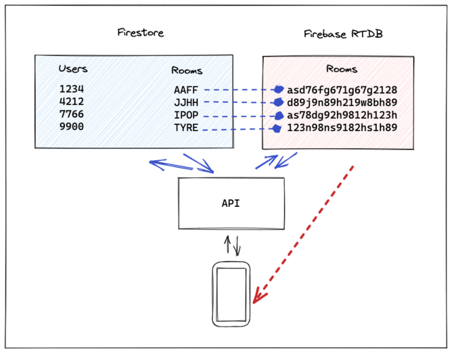

# Desafío

## Table of contents

- [Overview](#overview)
  - [The challenge](#the-challenge)
- [My process](#my-process)
  - [Built with](#built-with)
  - [API Documentation](#api-documentation)
  - [Useful resources](#useful-resources)

## Overview

### The challenge

- For this challenge, we propose that you create a chat in which every time you enter a chatroom, i.e. a URL, is generated. In addition, everyone who accesses that address must be able to send messages and read them.

- Use this [design](https://www.figma.com/file/ar2Ghg5lBYeQvvHA6B0lj4/dwf-m6-db-rooms?node-id=1%3A80) as a reference.

## My process

### Built with

- DB Realtime (Real Time Data Base - Firestore)
- DB NoSQL (Firestore)
- ExpressJS
- Flexbox

### API Documentation

- I made a documentation of my api using postman
  - [Rooms API](https://documenter.getpostman.com/view/17951846/UVJkBtCf)

### Useful resources

- [Firebase Docs](https://firebase.google.com/docs/database/security)

- [CORS](https://www.npmjs.com/package/cors)

  - Cross-Origin Resource Sharing (CORS) is a mechanism that uses additional HTTP headers to allow a user agent to obtain permission to access selected resources from a server in a different origin (domain) to which it belongs.

- [Vaadin Router](https://www.npmjs.com/package/@vaadin/router)

  - It uses the widely adopted express.js syntax for routes (/users/:id) to map URLs to Web Component views

- [Nano Id](https://www.npmjs.com/package/nanoid)

  - A tiny, secure, URL-friendly, unique string ID generator for JavaScript.

- [Express](https://www.npmjs.com/package/express)

  - Provides mechanisms for: Writing request handlers with different HTTP verbs in different URL paths (routes).

- [Nodemon](https://www.npmjs.com/package/nodemon)

  - Nodemon is a tool that helps develop node.js based applications by automatically restarting the node application when file changes in the directory are detected.

- [HTTP response status codes](https://developer.mozilla.org/en-US/docs/Web/HTTP/Status)
